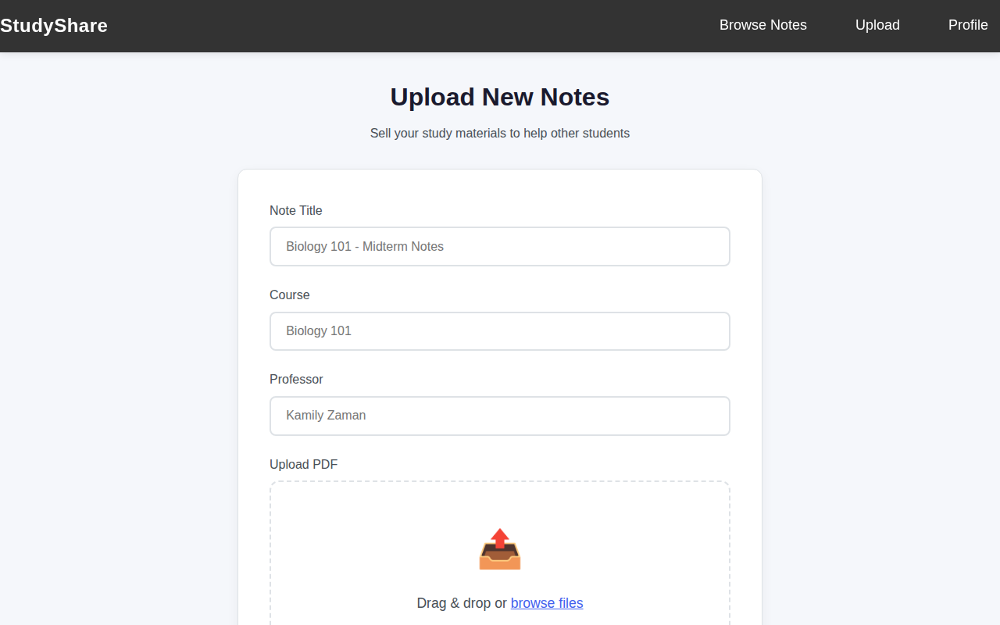
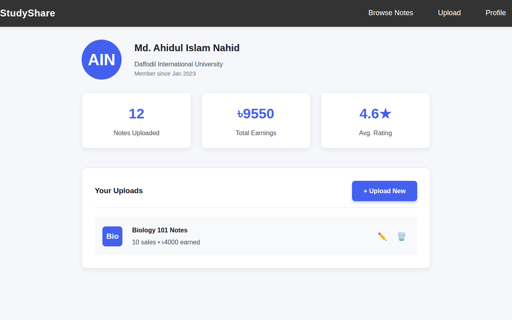

# study_share
# 📚 StudyShare — University Notes Marketplace

A frontend web application where university students can buy and sell course notes, study materials, and lecture summaries.

---

## 🖥️ Screenshots

### Home Page


### Browse Notes


### Upload Notes


### Student Profile


---

## ✨ Features

- **Browse & Search** — Filter notes by course, sort by rating, price, or popularity
- **Smart Auto-suggest** — Real-time search suggestions as you type
- **Upload & Sell** — Sellers can list their notes with pricing
- **Purchase Flow** — Complete buy-now experience with instant download
- **Student Profile** — Track your uploads, purchases, and earnings
- **Responsive Design** — Clean UI across all screen sizes

---

## 🛠️ Tech Stack

| Layer | Technology |
|-------|-----------|
| Frontend | HTML5, CSS3, JavaScript (Vanilla) |
| Icons | Font Awesome 6 |
| Architecture | Pure frontend (no backend required) |

---

## 📁 Project Structure

```
StudyShare/
├── index.html      # Landing page
├── browse.html     # Notes listing with search & filters
├── product.html    # Individual note detail page
├── upload.html     # Upload & sell your notes
├── purchase.html   # Checkout & download flow
├── profile.html    # Student profile & dashboard
├── main.js         # Core JS
└── css/
    ├── style.css   # Global styles
    └── auth.css    # Auth page styles
```

---

## 🚀 Live Demo

> Hosted on GitHub Pages

🔗 **[studyshare-live-link](https://ahidnahid.github.io/StudyShare)**

---

## ⚙️ Run Locally

No setup needed — pure frontend project.

1. Clone the repo
   ```bash
   git clone https://github.com/ahidnahid/StudyShare.git
   ```

2. Open `index.html` in any browser — done!

---

## 👨‍💻 Author

**Md. Ahidul Islam**
B.Sc in CSE — Daffodil International University

[](https://github.com/ahidnahid)
[](https://linkedin.com/in/md-ahidul-islam-41aa913bb)
